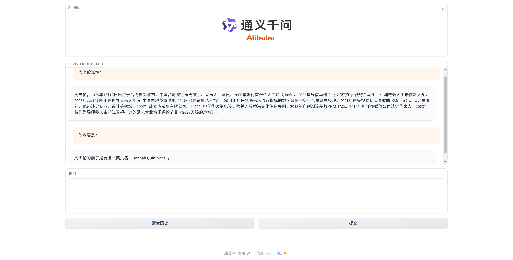

# qwen-vllm

[千问官方部署文档](https://github.com/QwenLM/Qwen?tab=readme-ov-file#deployment)

* 离线推理vllm_wrapper.py实现参考了[Qwen官方实现](https://github.com/QwenLM/Qwen/blob/main/examples/vllm_wrapper.py)
* 在线推理vllm_server.py和vllm_client.py实现参考了[vLLM官方实现-异步服务端](https://github.com/vllm-project/vllm/blob/main/vllm/entrypoints/api_server.py)、[vLLM官方实现-异步客户端](https://github.com/vllm-project/vllm/blob/main/examples/api_client.py)


# 核心技术原理

本项目旨在探索生产环境下的高并发推理服务端搭建方法，核心工作非常清晰，边角细节没有投入太多精力，希望对大家有帮助

* vLLM支持Continuous batching of incoming requests高并发批推理机制，其SDK实现是在1个独立线程中运行推理并且对用户提供请求排队合批机制，能够满足在线服务的高吞吐并发服务能力
* vLLM提供asyncio封装，在主线程中基于uvicorn+fastapi封装后的asyncio http框架，可以实现对外HTTP接口服务，并将请求提交到vLLM的队列进入到vLLM的推理线程进行continuous batching批量推理，主线程异步等待推理结果，并将结果返回到HTTP客户端
* vLLM天然支持流式返回next token，基于fastapi可以按chunk流式返回流式推理成果，在客户端基于requests库流式接收chunk并复写控制台展示，实现了流式响应效果


## 安装注意

- python版本为3.10
- cuda版本是12.1
- torch安装2.1
- 安装vllm gptq量化版, 安装时命令采用pip install . -i https://mirrors.aliyun.com/pypi/simple/
- 安装modelscope，命令pip install modelscope -i https://mirrors.aliyun.com/pypi/simple/
- 安装千问的tiktoken分词库 pip install tiktoken -i https://mirrors.aliyun.com/pypi/simple/

## 离线推理

python程序直接拉起模型，本地推理的方式。

```
python vllm_offline.py
提问:你好
你好！有什么我能帮你的吗？
提问:没事
好的，如果你需要任何帮助，请随时告诉我。
```

## 在线推理

启动一个远端python http服务端，通过http客户端调用的方式，并且可以流式返回推理结果。

启动HTTP服务端:
```
python vllm_server.py
```

启动HTTP客户端
```
python vllm_client.py
```

## webui

启动vllm_server后，可以再单独运行gradio_webui.py，它是基于gradio实现的聊天webui，支持多轮对话和流式应答，底层会与vllm_server实时远程调用。

```
python gradio_webui.py
```



## 通义千问Prompt原理

1.8B预训练版本，训练数据：

- 语料：[百度文库](https://wenku.baidu.com/view/11188178.html)

输入：英国航空，中文简称英航，是英国的国家航空公司，也是寰宇一家的创始成员及国际航空集团旗下子公司。<|endoftext|>
输出：英航的主要枢纽为伦敦希思罗机场及伦敦盖特威克机场。英航是欧洲第二大的航空公司、西欧最大的航空公司及全球三间其中一间曾拥有协和客机的航空公司，其余两间为法国航空和新加坡航空。<|endoftext|>

1.8B-Chat版本，基于1.8B预训练版本进行微调（SFT，S监督学习，FT微调）训练数据：

输入：<|im_start|>system\nyou are ahelper assitant.\n<|im_end|>
\n<|im_start|>user\n历史提问A？\n<|im_end|><|im_start|>assitant:历史回答A\n<|im_end|>
\n<|im_start|>user\n历史提问B？\n<|im_end|><|im_start|>assitant:历史回答B\n<|im_end|>
\n<|im_start|>user\n了解英国航空么？\n<|im_end|><|im_start|>assitant:\n<|endoftext|>
输出：英国航空，中文简称英航，是英国的国家航空公司。<|im_end|><|endoftext|>
